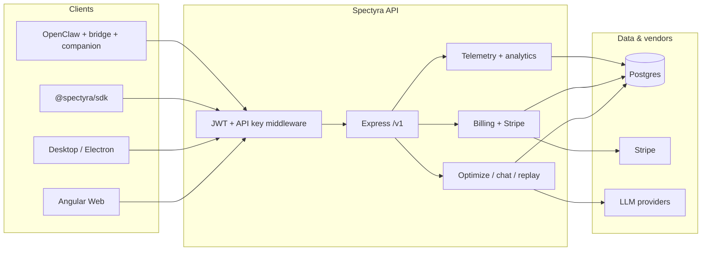

# Spectyra — architecture & flows

Single reference for how the product fits together: **apps**, **packages**, **auth**, **billing**, **OpenClaw vs developer SDK**, and the **HTTP API**. Implementation details live in source; this document is the map.

---

## 1. What Spectyra is

Spectyra is a **token and cost optimization layer** around LLM usage: it can trim prompts, run in **on** (optimize) or **off** (passthrough) modes, record runs and savings, and (for company accounts) sync **SDK telemetry** to the cloud for dashboards. The **underlying provider is never blocked** when Spectyra is off (or when entitlements require passthrough); Spectyra only changes how much work is sent when optimization is enabled and licensed.

---

## 2. Monorepo layout

| Path | Role |
|------|------|
| `apps/api` | Express **REST API** (`/v1/...`), Stripe webhooks, Postgres, entitlements, chat/replay/optimize pipelines. |
| `apps/web` | **Angular** marketing + dashboard (billing, projects, analytics, admin, superuser). |
| `apps/desktop` / `apps/desktop-pro` | **Electron** shells embedding the web app or OpenClaw-specific bundles; local companion integration. |
| `tools/local-companion` | Local HTTP service + dashboard for **OpenClaw**-style workflows and billing status. |
| `packages/sdk` | **Developer / in-app SDK** — wrap clients, telemetry, optimization calls to Spectyra Cloud. |
| `packages/openclaw-bridge` | **OpenClaw ↔ Spectyra** bridge types and helpers (agent host integration). |
| `packages/openclaw-skill` | Packaged **skill/plugin** surface for OpenClaw-style agents. |
| `packages/shared`, `packages/core-types` | Shared types, UI types, trial/banner helpers, etc. |
| `packages/optimizer-*`, `packages/optimization-engine`, … | Algorithms, execution graph, learning, workflow policy — used by API and tooling. |
| `supabase/migrations` | **One baseline** SQL file for Postgres/Supabase (`*_baseline_spectyra.sql`). Intended for **new** environments (`supabase db reset` / empty database). |

**Existing databases** that already applied the old incremental migrations should **not** re-apply the baseline from scratch; keep using migration history or use `supabase db dump` / schema diff to align. The API still runs **idempotent DDL on startup** (`ensurePlatformRolesSchema`, `ensureSdkTelemetrySchema`, `ensureUserAccountFlagsSchema`) so drift is limited.

The Supabase file is the **canonical** full schema + RLS for **greenfield** projects.

---

## 3. High-level system diagram

---

## 4. Two product surfaces: **OpenClaw** vs **developer / in-app SDK**

They share the same **API host** and **org/API-key model**, but ship through different packages and UX.

### 4.1 Developer / in-app SDK (`packages/sdk`)

- **NPM**: `@spectyra/sdk` (see `packages/sdk`).
- **Audience**: Applications embedding Spectyra (trimming, telemetry, server optimize).
- **Typical auth**: **Spectyra API key** (`X-SPECTYRA-API-KEY`) and/or user JWT for dashboard-backed flows.
- **Cloud features**: `POST /v1/telemetry/run`, project/environment analytics, billing status, entitlements — aligned with **SaaS tiers** (Developer Pro, Team Pro, Enterprise messaging in product UI).

Use this path when you are building **product code** that calls Spectyra as a library from Node or the browser (with CORS and key restrictions as configured).

### 4.2 OpenClaw stack (`openclaw-bridge`, `openclaw-skill`, desktop, `local-companion`)

- **Audience**: **OpenClaw** (and similar) **agent hosts** — local or desktop workflows, skills, and a local dashboard.
- **`packages/openclaw-bridge`**: Shared bridge contracts and integration glue between OpenClaw-shaped runtimes and Spectyra.
- **`packages/openclaw-skill`**: Skill packaging for agent tools that talk to Spectyra.
- **`tools/local-companion`**: Local service that can show plan status, open billing checkout, and proxy usage patterns without forcing everything through the SPA.
- **Auth**: Often **Supabase JWT** for account flows plus **API keys** for machine paths; **org-level `platform_exempt`** matters for key-only traffic (JWT carries `platform_roles` for staff; keys do not).

Use this path when the product is **“Spectyra inside OpenClaw”** rather than “SDK inside your SaaS repo.”

---

## 5. Authentication & tenancy

- **Supabase JWT** (`Authorization: Bearer …`): identifies a **user**; API resolves **org** via `org_memberships`. Used by web app and many account mutations. **Platform roles** (`platform_roles` table: `superuser`, `admin`, `exempt`) attach to the email and drive **superuser console** access and **billing bypass** on JWT routes (`billingAccessOpts` in `apps/api/src/middleware/auth.ts`).
- **API key** (`X-SPECTYRA-API-KEY`): identifies **org** (and optional project) for automation and SDKs. **No JWT platform role** on these requests — billing and savings gates use the **org row** (`platform_exempt`, subscription fields, observe-only flags).

Every mutating / sensitive path should assume **`req.context.org.id`** (or equivalent) is set only after the correct middleware.

---

## 6. Billing & entitlements (mental model)

- **Included usage**: Orgs can be on **`subscription_status = 'active'`** without a Stripe subscription id (no paid self-serve yet). Marketing copy refers to **included optimized tokens** before paid tiers.
- **`subscription_active` in API responses**: means **paid Stripe subscription** attached (`orgHasPaidStripeSubscription` in `orgsRepo`), not merely `subscription_status === 'active'`.
- **Stripe**: Checkout and webhooks under `/v1/billing/*`; webhook uses raw body (`apps/api/src/index.ts`).
- **Entitlements**: `apps/api/src/services/entitlement.ts` + `trialGate` middleware — optimized **mode = on** can require a valid license / access; observe and pass-through remain available per product rules.

---

## 7. HTTP API surface (Express)

All JSON routes below are under the **same origin** as configured; the API listens on `config.port` and mounts routers from `apps/api/src/index.ts`.

### 7.1 Global / infra

| Prefix | Purpose |
|--------|---------|
| `GET /health` | Liveness. |

### 7.2 Core optimization & runs

| Prefix | Purpose |
|--------|---------|
| `POST /v1/optimize` | Full server optimize pipeline (`serverOptimizeRouter`). |
| `POST /v1/chat` | Chat with optimization / observe hooks (`chatRouter`). |
| `POST /v1/replay` | Replay / proof flows (`replayRouter`). |
| `POST /v1/replay/simulate/*` | Simulation (`replaySimulateRouter`). |
| `GET/POST /v1/observe/*` | Observe-only optimizer lab (`optimizerLabHealthRouter` / `optimizerLabRouter`). |
| `POST /v1/studio/run` | Authenticated studio run (`studioRouter`). |
| `GET/POST /v1/proof/*` | Proof / verification (`proofRouter`). |
| `GET/POST /v1/runs/*` | Run listing and details (`runsRouter`). |
| `GET/POST /v1/savings/*` | Savings ledger surfaces (`savingsRouter`). |

### 7.3 Providers, scenarios, policies

| Prefix | Purpose |
|--------|---------|
| `GET /v1/providers` | Provider metadata (`providersRouter`). |
| `GET/POST /v1/scenarios/*` | Scenarios (`scenariosRouter`). |
| `GET/POST /v1/policies/*` | Workflow policy engine (`policiesRouter`). |

### 7.4 Auth & account (`/v1/auth`)

Implemented in `apps/api/src/routes/auth.ts` (names illustrative — read file for exact paths and bodies):

- **Bootstrap / account**: `POST /v1/auth/bootstrap`, `POST /v1/auth/ensure-account`, `POST /v1/auth/sync-billing-exempt`, `POST /v1/auth/register`, `POST /v1/auth/login` (API key).
- **Session**: `GET /v1/auth/me`.
- **API keys**: `POST/GET/DELETE /v1/auth/api-keys`, rotate endpoint under org/key ids.
- **Org lifecycle** (API key): `PATCH /v1/auth/org`, `DELETE /v1/auth/org`.
- **Entitlement**: `GET /v1/auth/entitlement`.

### 7.5 Billing & Stripe (`/v1/billing`)

`apps/api/src/routes/billing.ts`: checkout session creation, **webhook** at `/v1/billing/webhook` (raw body), status for dashboard, etc.

### 7.6 Account self-service (`/v1/account`)

Pause, resume, cancel subscription, delete account — see `apps/api/src/routes/account.ts`.

### 7.7 Admin & superuser

| Prefix | Purpose |
|--------|---------|
| `GET/PATCH/POST … /v1/admin/*` | Org admin, users, exempt flags (`adminRouter` + optimizer lab legacy mounts). |
| `GET/POST/PATCH … /v1/superuser/*` | Platform superuser console (`superuserRouter`) — `platform_roles`, org observe overrides, etc. |

### 7.8 SDK telemetry & project analytics

| Prefix | Purpose |
|--------|---------|
| `POST /v1/telemetry/run` | Per-call SDK telemetry (`telemetryRouter`). |
| `GET … /v1/projects/:projectId/…` | Project / environment analytics (`projectAnalyticsRouter`). |

### 7.9 Settings, provider keys, license

| Prefix | Purpose |
|--------|---------|
| `GET/PATCH … /v1/orgs/*` | Org settings + **provider keys** (`settingsRouter`, `providerKeysRouter` — both mounted under `/v1/orgs`). |
| `GET/POST … /v1/license/*` | Desktop / companion **license keys** (`licenseRouter`). |

### 7.10 Usage, analytics sync, anonymous

| Prefix | Purpose |
|--------|---------|
| `GET /v1/usage/*` | Usage and budgets (`usageRouter`). |
| `GET/POST /v1/analytics/*` | Session sync payloads (`analyticsSyncRouter`). |
| `POST /v1/anonymous/*` | Anonymous OpenClaw / installation telemetry (`anonymousUsageRouter`). |

### 7.11 Agent, integrations, audit, retention, SCIM

| Prefix | Purpose |
|--------|---------|
| `GET/POST /v1/agent/*` | Agent runs / events (`agentRouter`). |
| `GET/POST /v1/integrations/*` | Integration hooks (`integrationsRouter`). |
| `GET/POST /v1/audit/*` | Audit logs (`auditRouter`). |
| `POST /internal/retention/*` | Internal retention worker (`retentionRouter`). |
| `/scim/*` | SCIM stub (`scimRouter` — may return 501). |

---

## 8. Angular web app (`apps/web`)

- **Routes**: `apps/web/src/app/app.routes.web.ts` — marketing (`/openclaw`, `/in-app`), auth, **billing**, **projects** (`/projects/.../environments/...`), **analytics**, **admin**, **superuser**, settings, OpenClaw integration pages.
- **API base**: `environment.apiUrl` → `/v1/...` as above.
- **Guards**: `authGuard`, `superuserGuard` for privileged UI.

---

## 9. Data model (short)

Postgres (Supabase) holds:

- **Tenancy**: `orgs`, `org_memberships`, `projects`, `api_keys`, `license_keys`.
- **Billing**: Stripe ids, `subscription_status`, `subscription_current_period_end`, `cancel_at_period_end`, `platform_exempt`, seat limits, observe-only overrides.
- **Runs & savings**: `runs`, `savings_ledger`, `replays`, `baseline_samples`, `conversation_state`.
- **Agent / SDK**: `agent_runs`, `agent_events`, `sdk_run_telemetry`, `project_usage_daily`.
- **Enterprise**: `org_settings`, `project_settings`, `provider_credentials`, `audit_logs`.
- **Platform**: `platform_roles` (email → role).
- **Account state**: `user_account_flags` (pause / inactive flows).
- **Anonymous**: `anonymous_installations`, `anonymous_usage_events`.

RLS is enabled for **direct Supabase client** access; the API uses the **service role** and still enforces org boundaries in application code.

---

## 10. Typical request flows

### 10.1 “Optimize this prompt” (SDK or server)

1. Client sends `POST /v1/optimize` (or chat/replay variant) with API key or JWT.
2. Middleware attaches `req.context.org` (and optional project).
3. Entitlement / trial gate may attach **observe-only** context for savings accounting.
4. Optimizer packages run; response returns optimized messages / metadata.
5. Optional persistence to `runs` / `savings_ledger` depending on route and mode.

### 10.2 “Record company telemetry” (developer SDK)

1. Client sends `POST /v1/telemetry/run` with project + environment + token counts.
2. Row inserted into `sdk_run_telemetry`; rollups updated in `project_usage_daily` (see API implementation).
3. Dashboard reads aggregated data under `/v1/projects/...`.

### 10.3 “Open billing checkout”

1. Web or companion calls `POST /v1/billing/checkout` with success/cancel URLs.
2. Stripe Checkout session returned; user completes payment.
3. Webhook updates `orgs` subscription fields; UI refreshes billing status.

---

## 11. Where to look when you change behavior

| Concern | Primary location |
|---------|------------------|
| New REST endpoint | `apps/api/src/routes/*.ts`, mount in `apps/api/src/index.ts`. |
| Auth / org context | `apps/api/src/middleware/auth.ts`. |
| Billing / Stripe | `apps/api/src/routes/billing.ts`, `apps/api/src/services/storage/orgsRepo.ts`. |
| Entitlements / optimized gate | `apps/api/src/services/entitlement.ts`, `apps/api/src/middleware/trialGate.ts`. |
| Public SDK surface | `packages/sdk/src`. |
| OpenClaw integration | `packages/openclaw-bridge`, `packages/openclaw-skill`, `tools/local-companion`. |
| Dashboard UI | `apps/web/src/app/features/*`. |
| DB schema (new install) | `supabase/migrations/*_baseline_spectyra.sql` + API `ensure*Schema` helpers. |

---

## 12. Non-markdown files still under `docs/`

- `sample-code-*.json` — large example payloads for testing.
- `OPENCLAW_SPECTYRA_SCENARIO_AND_FLOW.pdf` — legacy PDF scenario; source-of-truth for day-to-day work is this markdown file plus code.

If you add new documentation, prefer **updating this file** or linking from it so future sessions have one entry point.
