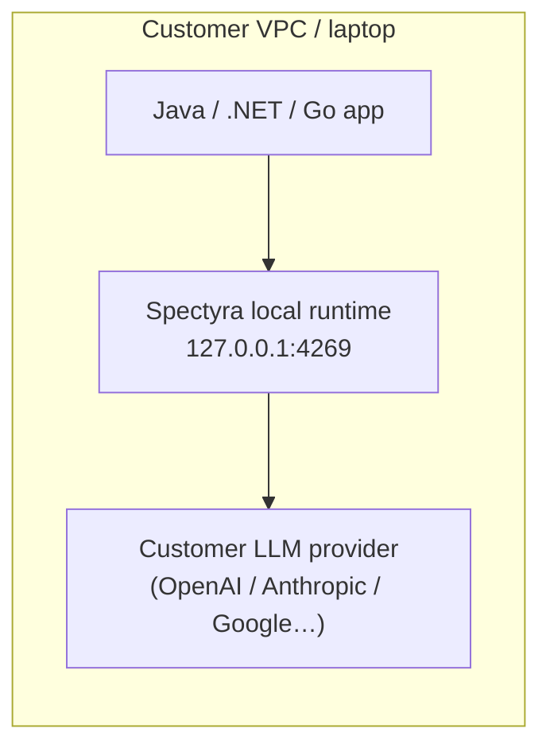
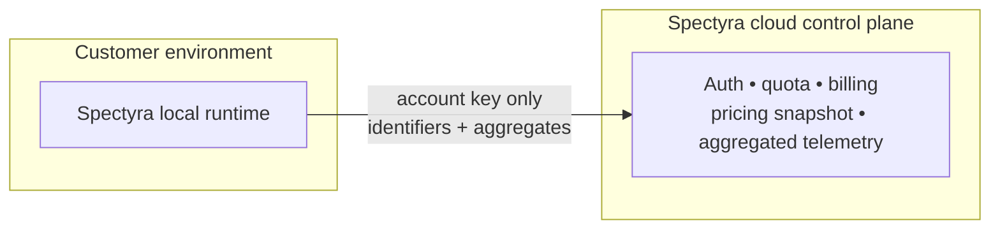

# Spectyra non-Node local runtime

This guide covers the **Rust localhost runtime** for teams using **Java, .NET, Go**, and other backends that cannot embed the Node/TypeScript Spectyra SDK directly.

## Who this is for

- You want Spectyra **optimization, savings visibility, and quota-aware behavior** for LLM usage from JVM, CLR, or native services.
- You keep **provider API keys on the machine or in your orchestrator secrets** (BYOK).
- You accept that **Spectyra cloud is control-plane only**: auth, billing, quota, entitlements, pricing snapshots, and aggregated analytics — never raw prompts.

## Two integration paths

| Path | When to use |
|------|-------------|
| **Node / TypeScript SDK** (`@spectyra/sdk`) | Best when your app already runs on Node or you can embed a thin TS worker. |
| **Local HTTP runtime** (this crate) | Best for Java / .NET / Go services calling `http://127.0.0.1:4269` from the same host or sidecar. |

Both paths preserve the same privacy model: **prompts and provider keys stay local**; optional cloud calls carry **identifiers + aggregates only**.

## Architecture





## Running the runtime

### Binary

From the workspace `runtime/` directory:

```bash
cargo build --release -p spectyra_local_runtime
./target/release/spectyra-runtime
```

Optional TOML config:

```bash
export SPECTYRA_RUNTIME_CONFIG=/etc/spectyra/runtime.toml
spectyra-runtime --config /etc/spectyra/runtime.toml
```

Environment highlights:

| Variable | Purpose |
|---------|---------|
| `OPENAI_API_KEY`, `ANTHROPIC_API_KEY`, `GEMINI_API_KEY` | Provider keys (read locally only). |
| `SPECTYRA_ACCOUNT_KEY` | Spectyra machine API key for **entitlements** and **pricing snapshot** refresh — **not** sent to providers. |
| `SPECTYRA_ACCOUNT_API_BASE` | Defaults to `https://api.spectyra.com/v1`. |
| `SPECTYRA_ANALYTICS_ENABLED` | `true` / `1` to enqueue aggregated telemetry POSTs. |
| `SPECTYRA_RUNTIME_BIND` | Override bind address (default `127.0.0.1:4269`). |

### Docker (example)

```bash
docker build -f runtime/Dockerfile -t spectyra/local-runtime runtime
docker run --rm \
  -p 127.0.0.1:4269:4269 \
  -e OPENAI_API_KEY=$OPENAI_API_KEY \
  -e ANTHROPIC_API_KEY=$ANTHROPIC_API_KEY \
  -e GEMINI_API_KEY=$GEMINI_API_KEY \
  -e SPECTYRA_ACCOUNT_KEY=$SPECTYRA_ACCOUNT_KEY \
  spectyra/local-runtime
```

## Backend integration model

1. Your service issues HTTP `POST /v1/chat/run` (or embeddings / OpenAI responses) to the local runtime with **camelCase JSON** bodies matching `runtime/contracts/openapi/spectyra-runtime.openapi.yaml`.
2. The runtime optionally applies **local transforms**, then calls the **provider REST API** using **your** API keys.
3. The JSON response adds **Spectyra-estimated cost before/after**, **savings**, and **quota snapshot** fields — without exposing prompts upstream.

## Savings visibility

- Per response: `costBefore`, `costAfter`, `savingsAmount`, `savingsPercent`, `warnings` (e.g. pricing fallback).
- Session rollups: `GET /v1/metrics/session` — cumulative totals while the process runs (in-memory).

## Account, quota, and billing

- `GET /v1/entitlements/status` on Spectyra cloud (called by the runtime with `SPECTYRA_ACCOUNT_KEY`) drives whether optimization is allowed and when session metrics **freeze** on quota exhaustion.
- Provider billing remains **direct between you and the model vendor**; Spectyra surfaces **estimates** using the downloaded pricing snapshot.

## Privacy summary

Prompts, completions, message bodies, retrieval chunks, and provider secrets **never** leave your environment through Spectyra telemetry. See `docs/privacy/byok-and-local-architecture.md`.

## OpenAPI

Machine-readable contract: `runtime/contracts/openapi/spectyra-runtime.openapi.yaml`.

## Client examples

Language-specific pseudocode and patterns: `clients/java/README.md`, `clients/dotnet/README.md`, `clients/go/README.md`.
