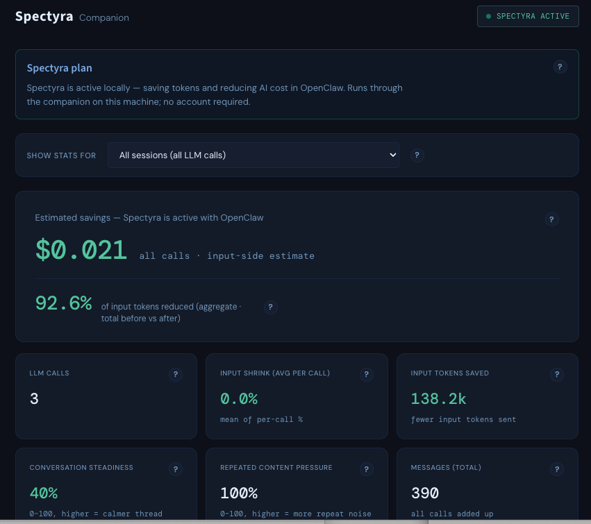

# Spectyra

## Install and run Spectyra

Run once:

```bash
npm install -g @spectyra/local-companion@latest && spectyra-companion start --open
```

If you close the companion and want to start it again later:

```bash
spectyra-companion start --open
```

Dashboard:

`http://127.0.0.1:4111/dashboard`

---

## What Spectyra does

Spectyra helps reduce wasted tokens and lower AI cost while you use OpenClaw.

It applies **multiple optimization layers** across prompt structure, context handling, repeated instructions, and flow efficiency—not a single “compress the prompt” trick. Spectyra is **not just compression**. It is designed to remove waste **without changing the result you are trying to get**: the intended outcome should stay aligned.

---

## What you will see

The dashboard shows:

- Token savings and estimated cost savings  
- Optimization activity and health  
- Request- and session-level views of what changed  

---

## Dashboard preview



---

## Using OpenClaw

Point models at **`spectyra/smart`** (or `spectyra/fast` / `spectyra/quality`). The companion must be running while you use OpenClaw.

If traffic is not flowing yet, restart the companion:

```bash
spectyra-companion start --open
```
